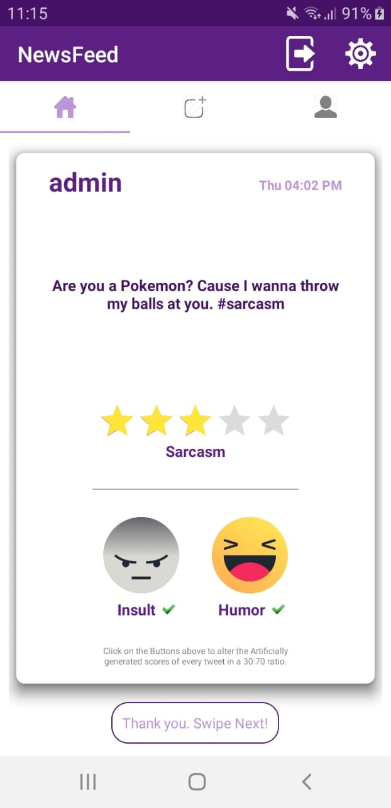
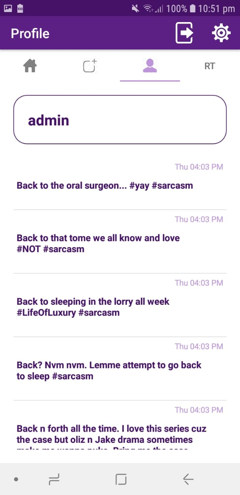
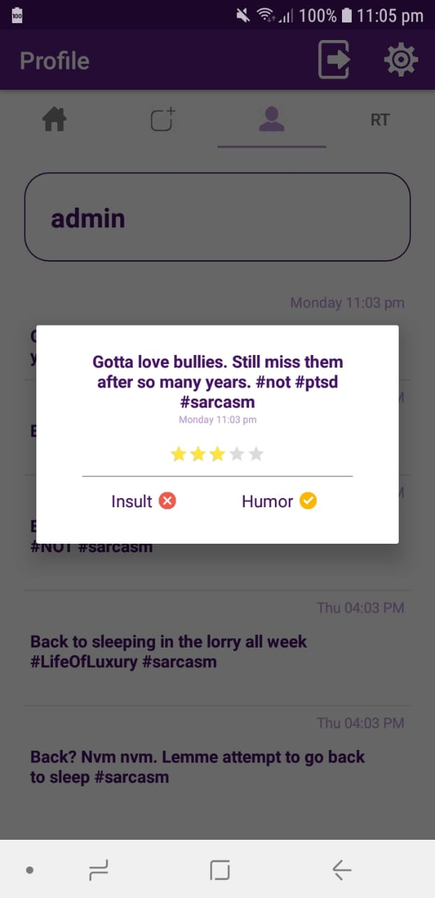

# Sarcasmania: Sarcasm Exposed!

 Hello there! This is an article featuring the release of Sarcasmania-API (now available for download), as well as a detailed description of the project, for your interest! 
  
<h4> Google Playstore Download Link: http://bit.ly/2JTBYFk </h4>  

  
   
  
  
  
  
  
  

  
<h4> Also Available on Amazon App-Store for a FREE Checkout: https://amzn.to/30ByWMa </h4>  
<h3> Application Description </h3>  

 This is a Social Media Application where a nest of sarcastic tweets is measured on a polar scale of hilariousness and offensiveness by our users. The application allows our audience to post, view and impartially react to sarcastic tweets uploaded by our large pool of customers chronologically. Finally, an infinitely-running model on our server incorporates this input in a Man VS Machine probability-ratio (30/70) of humor and insult respectively. This application is part of a Natural Language Processing Research Project of improving Sarcasm Detection in Text through Continual Learning and Sentimental Analysis. 

<h5> To Read More about the implementation: http://bit.ly/2VMy8Fs </h5>
<h5> To Read More about the research involved: http://bit.ly/2YzGX2e </h5>
